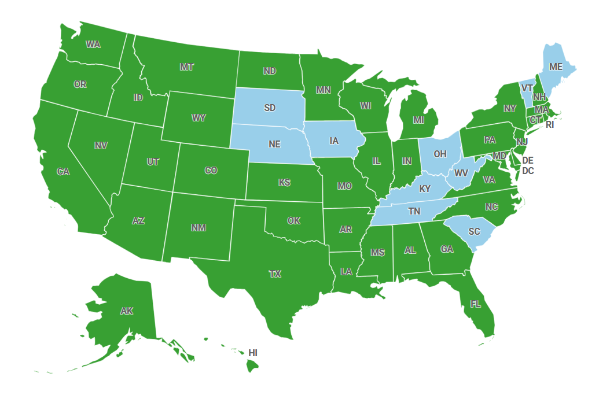
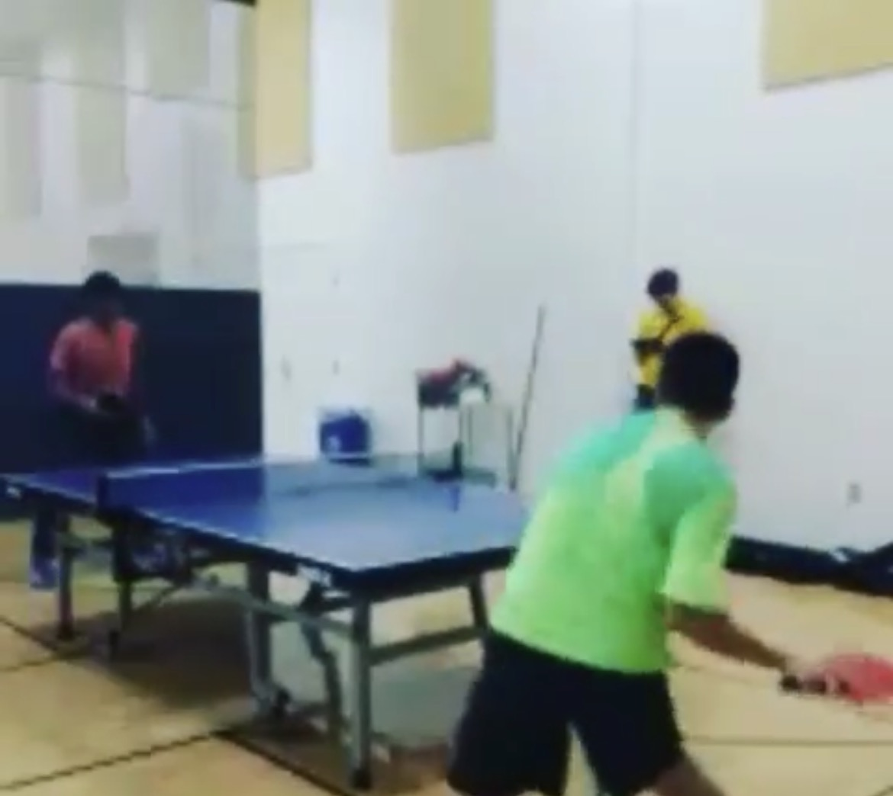
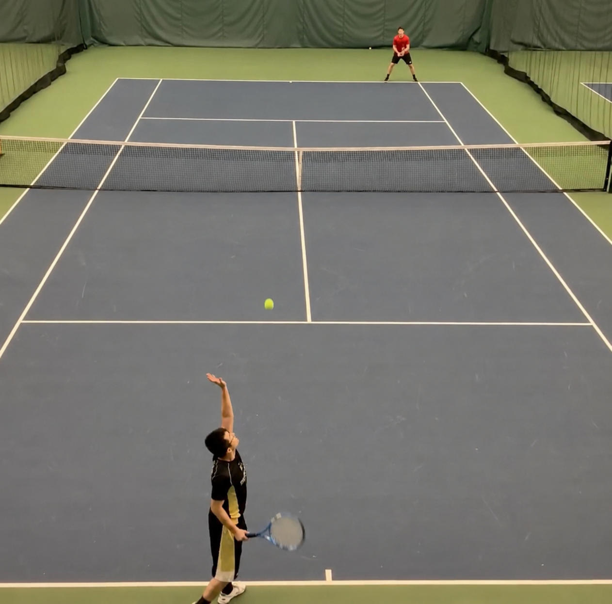
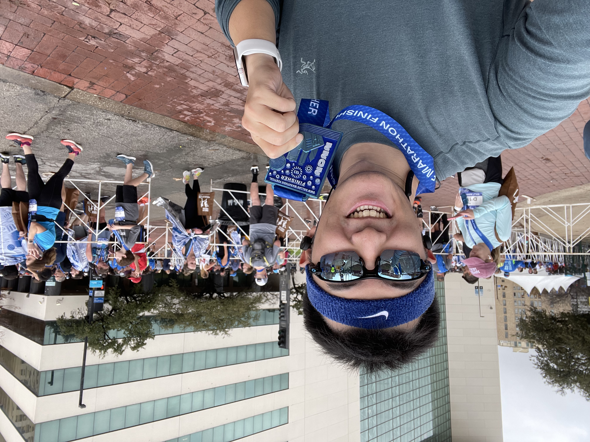
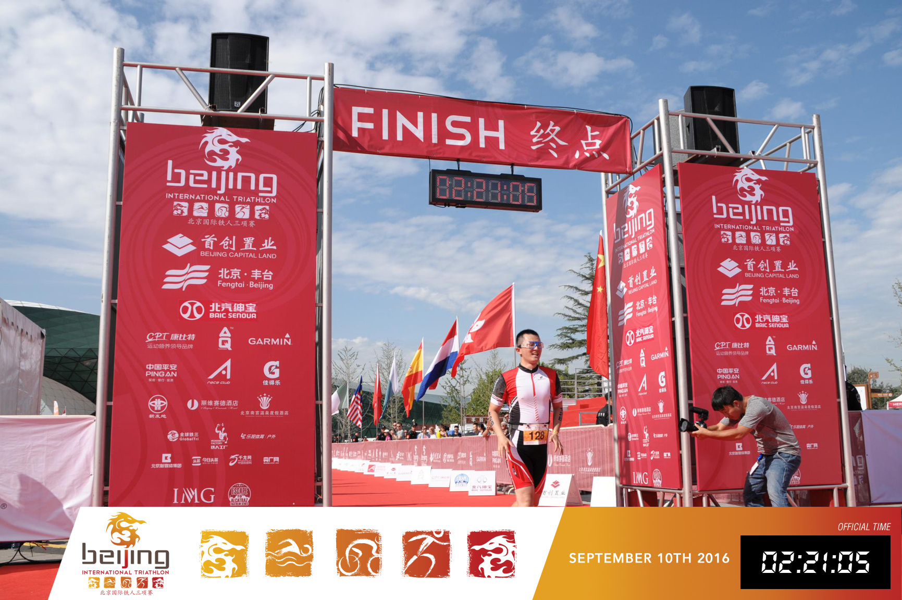

::: {.about-section}

## Travel

I enjoy traveling and driving. So far, I have visited **40 U.S. states**. Each journey has given me opportunities to experience different cities and cultures, meeting new people, and creating unforgettable memories.

A map of the United States with footprints marking the states I have visited.

:::

::: {.about-section}

Some memories from intramural sports and tennis tournaments.

## Playing

I enjoy different racket sports, especially **table tennis, badminton, and tennis**. I started playing table tennis at a young age. During college, I was a member of both the university **table tennis team** and **badminton team**. They require quick reactions, but also patience and concentration.

:::

::: {.about-section}

## Endurance

I also enjoy running and swimming. Over the years, I have completed several running and triathlon events. They gave me a different kind of feeling when I build endurance, consistency, and the ability to continue moving forward.

2015

Qinhuangdao International Marathon

2016

Beijing International Triathlon

2022

Dallas Marathon

Some memories from running and triathlon events.

:::

::: {.about-section}

Scan the QR code to explore my travel notes.

## Writing

I also enjoy writing. During my travels, I document my journeys on my personal WeChat Official Account, **行囊中的梦** (*Dreams in My Backpack*). It is part travel diary and part photo wall, the people I have met, and the moments I want to remember.

If you are interested, you can scan the QR code to follow the account and browse my travel notes.

:::

