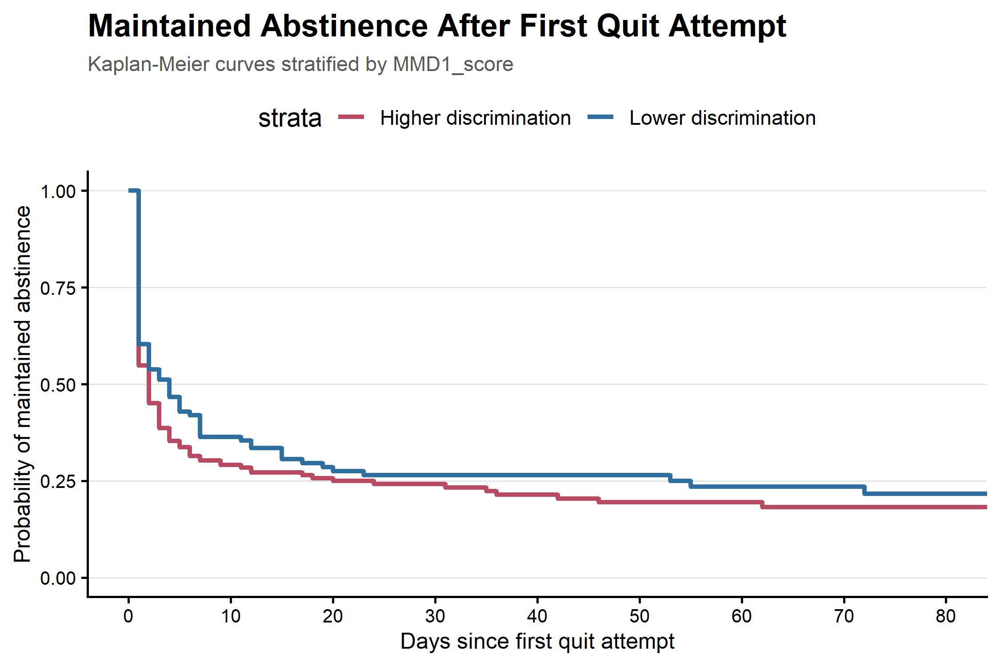
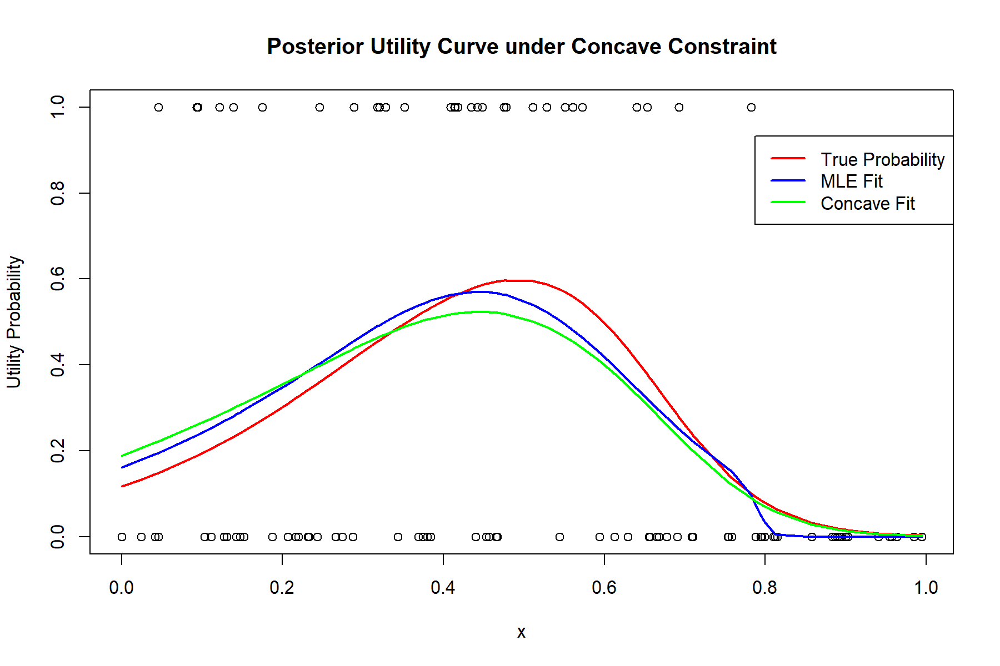
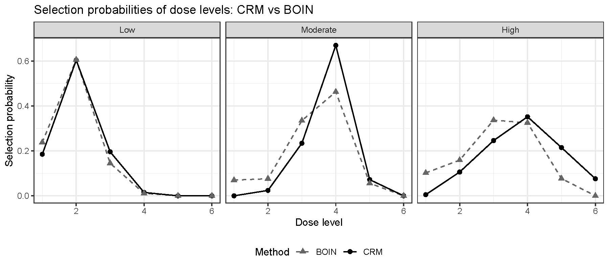
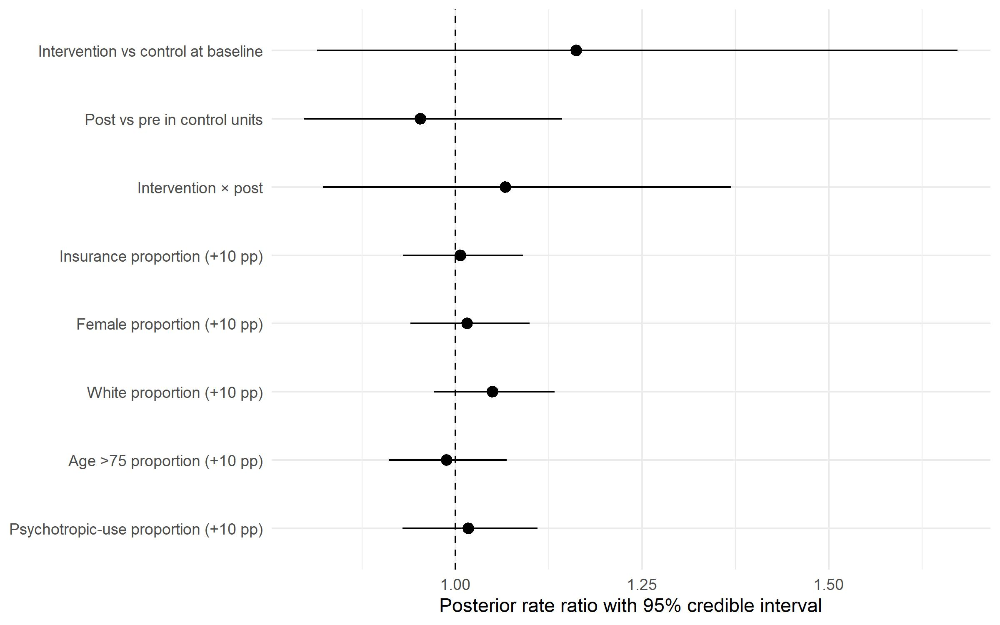

My research interests include applied statistics, Bayesian biostatistics, statistical computing, and clinical study design. I am particularly interested in developing practical and reproducible statistical methods for biomedical research, including Bayesian modeling, adaptive dose finding, longitudinal data analysis, and statistical consulting.

:::: {.grid .project-entry}

::: {.g-col-12 .g-col-md-4}

{width="95%"}

:::

::: {.g-col-12 .g-col-md-8}

Longitudinal EMA Analysis of Smoking Cessation Dynamics

`R · Survival Analysis · Logistic Regression · Cox Models · EMA Data`

This project analyzed ecological momentary assessment data from a smoking
cessation study to characterize a complete post-quit behavioral sequence.
I developed participant-day smoking indicators from repeated EMA reports,
handled missing daily assessments, and constructed event and duration
outcomes for each stage of the cessation process.

:::

::::

:::: {.grid .project-entry}

::: {.g-col-12 .g-col-md-4}

{width="95%"}

:::

::: {.g-col-12 .g-col-md-8}

Bayesian Shape-Constrained Modeling of Dose–Utility Curves

`R · MCMC · B-Splines · Bayesian Computation · Shape-Constrained Regression`

This project developed a Bayesian shape-constrained spline model for
estimating binary dose–utility relationships. I represented concavity
on the logit scale through a cubic B-spline edge basis and nonnegative
cone coefficients, then derived a custom auxiliary-variable Gibbs
sampler with truncated normal and gamma updates.

Using simulated efficacy and toxicity outcomes, I compared posterior
utility estimates with the known generating curve and a
shape-constrained maximum-likelihood fit.

:::

::::

:::: {.grid .project-entry}

::: {.g-col-12 .g-col-md-4}

{width="95%"}

:::

::: {.g-col-12 .g-col-md-8}

Simulation-Based Comparison of CRM and BOIN Dose-Finding Designs

`R · C++ · Rcpp`

This project implements and compares the **Continual Reassessment
Method (CRM)** and the **Bayesian Optimal Interval (BOIN)** design for
adaptive dose finding in Phase I clinical trials.

I developed Monte Carlo simulation engines in C++ through Rcpp,
including grid-based Bayesian posterior updating for CRM and isotonic
regression for BOIN. The two methods were evaluated under three
dose-toxicity scenarios based on MTD selection, patient allocation,
toxicity, overdose exposure, and computational efficiency.

:::

::::

:::: {.grid .project-entry}

::: {.g-col-12 .g-col-md-4}

{width="95%"}

:::

::: {.g-col-12 .g-col-md-8}

Bayesian Modeling of Hospital Fall Rates

`R · Stan · rstanarm · MCMC · Bayesian Poisson Regression`

This project analyzed monthly hospital fall counts from a 26-month
pre/post intervention study. I developed a hierarchical Bayesian
Poisson regression model that adjusted for patient-day exposure,
hospital-level heterogeneity, study period, intervention status, and
unit-level patient characteristics.

I evaluated model performance using MCMC convergence diagnostics,
posterior predictive checks, and PSIS-LOO cross-validation. Posterior
rate ratios indicated substantial uncertainty around the intervention
effect, with no clear evidence that the intervention reduced fall rates
relative to the control group.

:::

::::